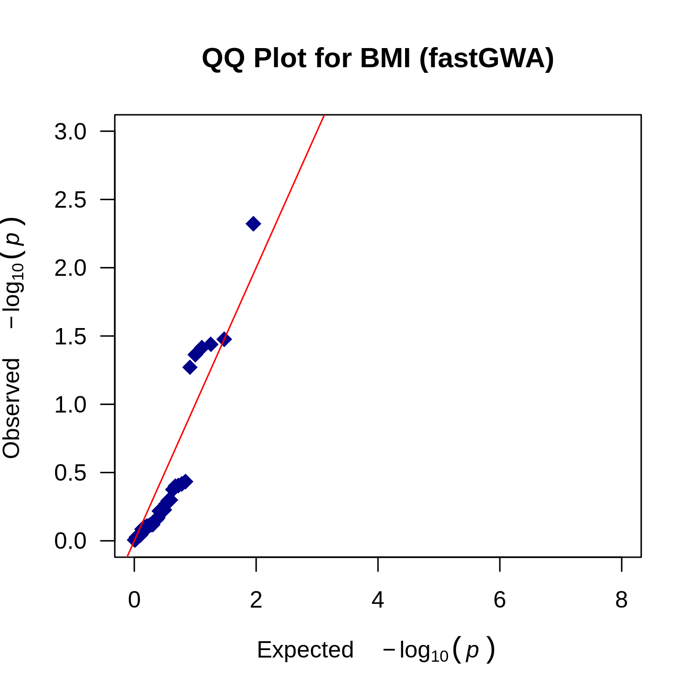
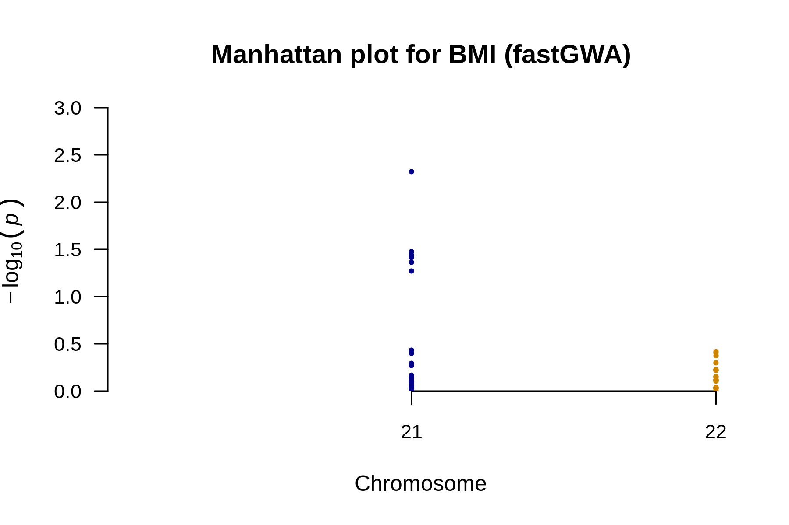
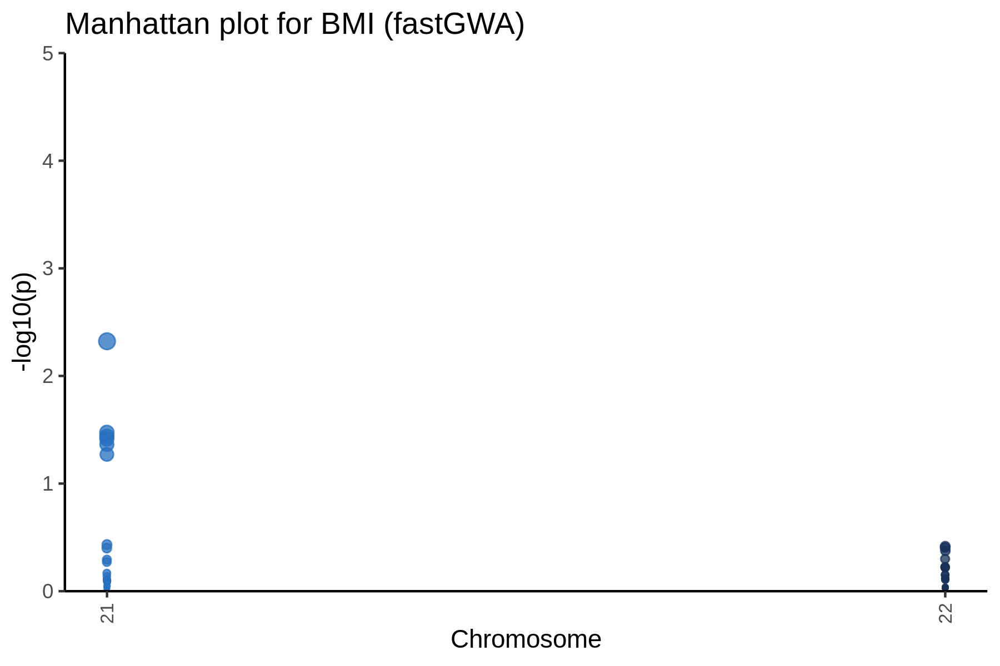

# QQ plot for BMI



---

# Manhattan plot for BMI



---

# Manhattan plot for BMI



---

# Result files
```
output/phenotypes_BMI.fastGWA.analysis_summary.md
output/phenotypes_BMI.fastGWA.manhattan_annotated.png
output/phenotypes_BMI.fastGWA.manhattan.png
output/phenotypes_BMI.fastGWA.plot_data.rds
output/phenotypes_BMI.fastGWA.qq.png
output/phenotypes_BMI.fastGWA.snp_counts.txt
output/phenotypes_BMI.fastGWA.snp_stats.gz
output/phenotypes_BMI.fastGWA.snp_stats.log
output/phenotypes_BMI.fastGWA.snp_stats_original_columns.gz
```
